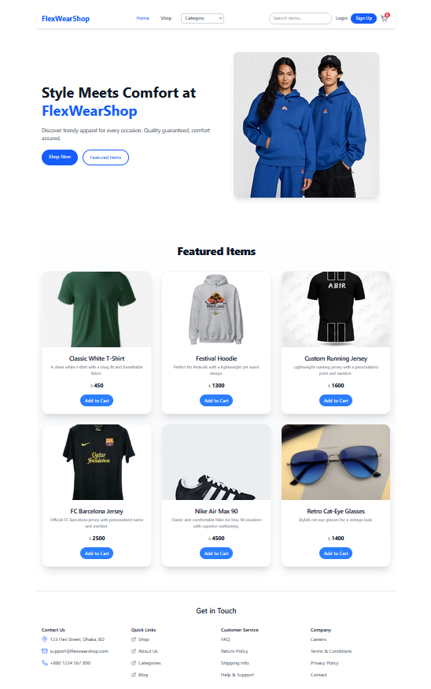

# 🛍️ FlexWearShop

FlexWearShop is a modern, responsive shopping web application built with **React**, **Tailwind CSS**, and **React Router**. It features an intuitive UI with product listings, search functionality, a cart system, category filtering, and a checkout flow.

### Links

Live Site URL: [🛍️ Visit FlexWearShop](https://flex-wear-shop.vercel.app/) 
Live Site URL 2: [🛍️ Visit FlexWearShop](https://flexwearshop.pages.dev/)

### The Final Output

  
  
  
  

---

## ✨ Features

- 🔍 **Live Search with Dropdown**  
  Instant search suggestions with images and prices.

- 🛒 **Cart Panel**  
  Right slide-in cart with quantity controls, product removal, and total calculation.

- 🛍️ **Shop Page**  
  Browse all products and filter by categories.

- 👕 **Product Detail Page**  
  Full-screen product details with image, price, description, and add-to-cart functionality.

- 💳 **Checkout Flow**  
  View order summary, place order, and show order success with cart reset.

- 🔐 **Authentication Routes**  
  Basic routes for Login and Sign Up screens.

- 📱 **Responsive Design**  
  Optimized for desktop and mobile with a toggleable mobile menu.
- 🧪 **Unit Testing** 
  Tested using **Vitest** and **React Testing Library**

---

## 🧰 Tech Stack

- ⚛️ **React**
- 💨 **Tailwind CSS**
- 🧪 **Vitest + React Testing Library**
- 🔀 **React Router DOM**
- 🛠️ **PropTypes** for component validation

## How to Use

1. Browse products in the **Shop** page.
2. Click on any product to view details.
3. Add items to the **Cart** from product pages.
4. Open the **Cart Panel** to increase, decrease, or remove items.
5. View calculated **subtotal, tax, and total**.
6. Proceed to **Checkout** or return to shop.
7. Use **Login/Signup** links to simulate user account navigation.

## Plan for Future Improvements

* **Real product API integration**
* **Checkout functionality with Stripe**
* **Authentication with Firebase/Auth0**
* **Wishlist or Favorites feature**
* **Admin dashboard for product management**
* **Order history tracking**
* **User profile and address book**
* **Dark mode support**
* **Testing all components throughly**
* **Loading option where necessary**

---

## Author

- Facebook - [@mainul islam](https://web.facebook.com/mmmuinul.islam/)
- LinkedIn - [@mainul islam](https://www.linkedin.com/in/mainul-islam-nirob/)
- Twitter - [@mainul](https://twitter.com/Mainuli96601040)
- Github - [@Mainul-Islam-Nirob](https://github.com/Mainul-Islam-Nirob)
